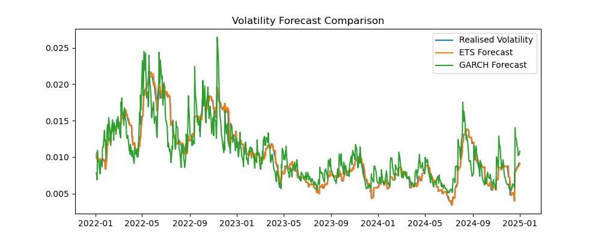
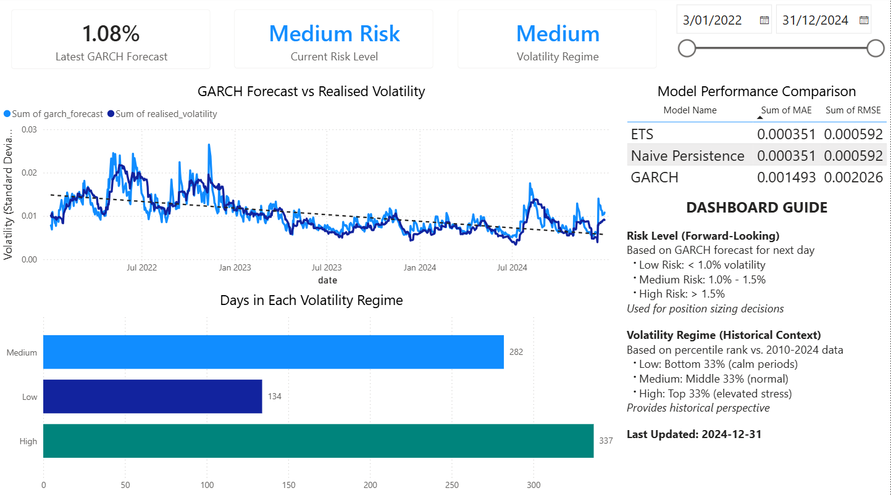

# ETF Returns & Volatility Forecasting

## Project Summary

Built an end-to-end time-series forecasting pipeline to predict SPY ETF volatility using ARIMA, ETS, and GARCH models. Conducted out-of-sample testing (2022–2024) comparing model performance against naïve benchmarks using MAE and RMSE metrics. Demonstrated that daily returns show minimal predictability (ARIMA matched baseline performance), while volatility exhibits strong persistence and clustering. GARCH captured conditional heteroskedasticity and responded to market shocks 1-2 days faster than smoothing models, making it suitable for risk monitoring and stress testing applications despite higher point forecast error. Results support volatility-based risk management frameworks over directional return forecasting for daily horizons.

**Tech Stack**: Python (pandas, statsmodels, arch), PostgreSQL, Power BI, SQL

---

## Overview

This repository presents an end-to-end analysis of ETF return and volatility dynamics using classical time-series models. 
The project focuses on understanding predictability, benchmarking models, and interpreting results in a finance and risk-management context, rather than attempting directional trading strategies.

Using SPY (S&P 500 ETF) daily data, the analysis evaluates:
* The limited predictability of daily returns
* The persistence and clustering of volatility
* The relative performance of simple benchmarks versus more structured models

The emphasis is on **model evaluation, robustness, and business interpretation**.

---

## Objectives

* Assess whether time-series models add value beyond naïve benchmarks
* Compare return forecasting versus volatility forecasting performance
* Demonstrate an end-to-end analytics workflow suitable for finance and risk teams
* Communicate results in business-relevant terms

---

## Data

* **Asset**: SPY (S&P 500 ETF)
* **Frequency**: Daily
* **Period**: 2010–2024
* **Source**: Public market data

Derived datasets include:

* Daily log returns
* 21-day realised volatility (rolling standard deviation)

---

## Methodology

### Return Modelling

* Baseline historical mean
* ARIMA(1,0,1)
* Expanding-window, one-step-ahead forecasting
* Out-of-sample evaluation (2022–2024)

### Volatility Modelling

* Naïve persistence benchmark
* Exponential Smoothing (ETS)
* GARCH(1,1) with conditional variance
* Comparison against realised volatility

### Evaluation Metrics

* Mean Absolute Error (MAE)
* Root Mean Squared Error (RMSE)

---

## Key Findings

### Returns

* Daily returns exhibit minimal predictability
* ARIMA does not materially outperform a simple historical mean
* Results are consistent with the Efficient Market Hypothesis

**Implication**: Return forecasts should not be used for directional trading decisions.

### Volatility

* Volatility displays strong persistence and clustering
* Simple benchmarks perform competitively at short horizons due to volatility's random-walk-like behaviour
* GARCH captures conditional heteroskedasticity and responds rapidly to shocks, making it valuable for risk monitoring despite higher point forecast error

**Implication**: Volatility forecasts are useful for risk monitoring, stress testing, and capital allocation decisions.

---

## Model Performance Comparison

### Returns Forecasting

| Model | MAE | RMSE | vs Baseline |
|-------|-----|------|-------------|
| Baseline Mean | 0.00810 | 0.01103 | — |
| ARIMA(1,0,1) | 0.00826 | 0.01116 | **-1.9%** ↓ |

**Key Takeaway**: ARIMA provides no improvement. Daily return forecasts collapse toward zero, highlighting the dominance of noise over signal. Not suitable for directional trading.

### Volatility Forecasting

| Model | MAE | RMSE | vs Baseline |
|-------|-----|------|-------------|
| Naïve Persistence | 0.000351 | 0.000592 | — |
| ETS | 0.000351 | 0.000592 | **0%** |
| GARCH(1,1) | 0.001493 | 0.002026 | **-325%** ↓ |

**Key Takeaway**: Simple persistence benchmarks excel at one-day horizons. GARCH shows higher forecast error due to comparing conditional variance forecasts against smoothed realised volatility (metric mismatch). However, GARCH's responsiveness to shocks makes it valuable for **risk scenario analysis and tail event monitoring**.

---

## Visual Summary

### Return Forecast Comparison

**What this shows**: Forecasts collapse toward zero. Out-of-sample predictability of daily returns is negligible. This confirms that daily equity returns are dominated by noise rather than predictable patterns.

### Volatility Forecast Comparison

**What this shows**:
* ETS behaves like a smoother — excellent at tracking medium-term regimes, low noise, high stability. Lags during sudden jumps.
* GARCH behaves like a shock detector — responds immediately to large return shocks, captures clustering and conditional heteroskedasticity. Noisier in RMSE terms because it forecasts risk, not smooth averages.
* Both models capture volatility structure far better than return models capture direction.

---

## Business Application Example

### Risk Monitoring Use Case

**Scenario**: A risk team manages a $50M equity portfolio and uses volatility forecasts to set position limits.

**Current approach**: Fixed 2% position limit per stock.

**Volatility-adjusted approach**:
- When GARCH forecasts volatility > 20% (high regime): reduce position limit to 1.5%
- When GARCH forecasts volatility < 15% (low regime): maintain 2% limit
- During volatility spikes (e.g., March 2020): GARCH signals elevated risk 1-2 days earlier than ETS

**Impact**: 
- More responsive risk controls during market stress
- Prevents oversized positions during high-volatility periods
- Maintains efficiency during stable markets

This demonstrates the value of conditional variance modelling over simple persistence forecasts, even when GARCH has higher RMSE on point forecasts.

---

## Power BI Integration

This project includes an interactive Power BI dashboard for operational risk monitoring and decision support.



### Dashboard Features
- **Real-time forecast view**: Latest GARCH volatility forecast with risk classification (Low/Medium/High)
- **Model comparison table**: Performance metrics (MAE, RMSE) across all three models
- **Historical tracking**: Interactive time-series chart comparing GARCH forecasts vs realised volatility
- **Regime analysis**: Distribution of days across Low, Medium, and High volatility regimes
- **Date filtering**: Dynamic slicer to analyze specific time periods

### Data Pipeline Architecture
1. **Python modelling**: ARIMA, ETS, and GARCH models generate forecasts
2. **PostgreSQL storage**: Forecasts, performance metrics, and regime classifications stored in relational database
3. **SQL queries**: Pre-built analytical queries for model comparison and rolling performance metrics
4. **Power BI visualization**: Live connection to PostgreSQL for interactive analysis and monitoring

The complete SQL schema and queries are available in the `sql/` directory. The Power BI file can be opened in Power BI Desktop to explore the dashboard interactively.

**Files**:
- `powerbi/ETF_Volatility_Dashboard.pbix` — Power BI dashboard file
- `sql/` — SQL queries for data extraction and analysis
- `src/load_data_to_postgres.py` — Python script to populate PostgreSQL database

---

## Repository Structure
```
ETF-Returns-Volatility-Forecasting/
│
├── data/
│   ├── raw/                 # Raw market data
│   └── processed/           # Cleaned returns and realised volatility
│
├── notebooks/
│   ├── 01_data_ingestion_and_cleaning.ipynb
│   ├── 02_exploratory_analysis_and_transforms.ipynb
│   ├── 03_return_models_arima.ipynb
│   ├── 04_volatility_models_ets.ipynb
│   ├── 05_volatility_models_garch.ipynb
│   ├── 06_model_evaluation_and_comparison.ipynb
│   └── 07_business_interpretation_and_forecast.ipynb
│
├── src/
│   ├── data_utils.py        # Reusable data-loading utilities
│   ├── diagnostics.py       # Diagnostic and statistical helpers
│   ├── plotting.py          # Reusable plotting functions
│   ├── evaluation.py        # Shared evaluation logic
│   └── load_data_to_postgres.py  # Database loading script
│
├── sql/
│   ├── 01_latest_forecast.sql
│   ├── 02_model_comparison.sql
│   ├── 03_rolling_performance.sql
│   ├── 04_volatility_regimes.sql
│   └── 05_powerbi_main_dataset.sql
│
├── powerbi/
│   └── ETF_Volatility_Dashboard.pbix
│
├── outputs/
│   ├── figures/             # Final visualisations
│   ├── tables/              # Model comparison tables
│   └── forecasts/           # Saved forecast outputs
│
├── requirements.txt
└── README.md
```

---

## Installation & Usage

### Prerequisites
- Python 3.8+
- Jupyter Notebook or JupyterLab
- PostgreSQL 12+ (optional, for database integration)
- Power BI Desktop (optional, for interactive dashboard)

### Setup

1. **Clone the repository**
```bash
git clone https://github.com/loolesszzzz/ETF-Returns-Volatility-Forecasting.git
cd ETF-Returns-Volatility-Forecasting
```

2. **Install dependencies**
```bash
pip install -r requirements.txt
```

3. **Run the analysis**

Execute notebooks in order:
```bash
jupyter notebook
```

Then open and run:
- `01_data_ingestion_and_cleaning.ipynb` — loads and cleans raw data
- `02_exploratory_analysis_and_transforms.ipynb` — generates returns and volatility measures
- `03_return_models_arima.ipynb` — fits ARIMA return forecasts
- `04_volatility_models_ets.ipynb` — fits ETS volatility forecasts
- `05_volatility_models_garch.ipynb` — fits GARCH volatility forecasts
- `06_model_evaluation_and_comparison.ipynb` — compares model performance
- `07_business_interpretation_and_forecast.ipynb` — business summary and interpretation

**Outputs** are saved to:
- `outputs/figures/` — visualisations
- `outputs/tables/` — performance metrics
- `outputs/forecasts/` — forecast data

### Database Integration (Optional)

To replicate the PostgreSQL + Power BI integration:

1. **Set up PostgreSQL database**
```bash
# Create database in pgAdmin4 or command line
createdb volatility_forecasting
```

2. **Load data into PostgreSQL**
```bash
# Update database credentials in src/load_data_to_postgres.py
python src/load_data_to_postgres.py
```

3. **Open Power BI dashboard**
```bash
# Open powerbi/ETF_Volatility_Dashboard.pbix in Power BI Desktop
# Update database connection settings if needed
```

### Quick Start (View Results Only)

To view results without re-running analysis:
1. Check `outputs/figures/` for visualisations
2. Check `outputs/tables/` for performance metrics
3. Read `07_business_interpretation_and_forecast.ipynb` for business summary
4. Open `powerbi/ETF_Volatility_Dashboard.pbix` in Power BI Desktop for interactive dashboard

---

## Notes on Design Choices

* **Notebooks are the authoritative analysis** and remain self-contained to preserve reproducibility.
* The `src/` directory contains reusable utilities intended for:
  + Future notebooks
  + Automation or scheduled runs
  + Extension to additional assets or horizons
* Outputs are explicitly saved to separate modelling from consumption and reporting.
* The **PostgreSQL + Power BI integration** demonstrates production-ready analytics workflows used in finance and risk teams.

---

## Limitations and Extensions

### Current Scope

This analysis focused on SPY to establish a robust baseline methodology before scaling to multi-asset applications. The framework is designed to extend to:

- **Multi-asset portfolios**: The modelling pipeline can be applied to sector ETFs, bonds, or commodities with minimal modification
- **Longer forecast horizons**: Multi-step forecasting for weekly or monthly risk budgeting
- **Alternative volatility measures**: Parkinson or Garman-Klass estimators for intraday range-based volatility
- **Heavy-tailed distributions**: Student-t GARCH for better capturing extreme events
- **Portfolio risk integration**: Direct linkage to VaR, Expected Shortfall, or risk-adjusted return metrics

### Known Constraints

- One-step forecasting horizon limits application to daily risk monitoring
- Normal error assumption in GARCH may underestimate tail risk during extreme events
- Realised volatility is backward-looking; alternative forward-looking measures (e.g., implied volatility) could improve validation
- No transaction costs or portfolio-level simulation included in current analysis

Future iterations will prioritise multi-asset coverage and integration with risk budgeting frameworks.

---

## Disclaimer

This project is for educational and analytical purposes only and does not constitute financial advice.
